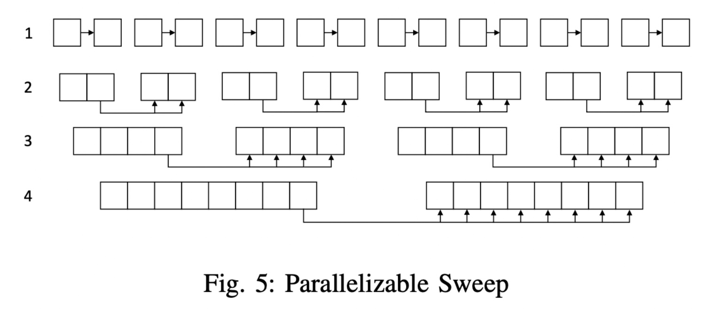
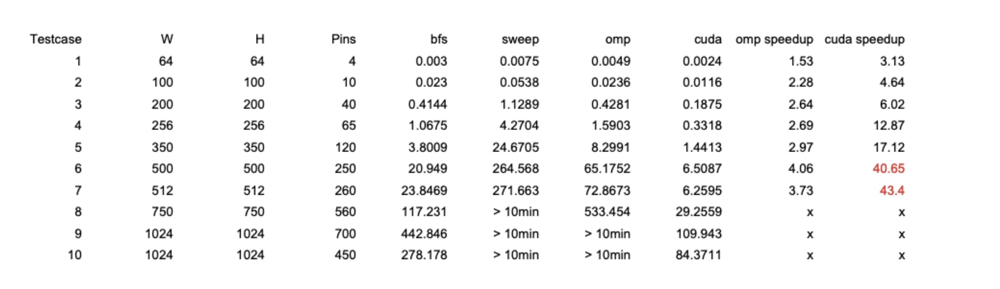

# Parallelized-maze-routing
NTHU CS. 11020 CS411100. Introduction to Parallel Computing. Final Project.

Motivated by the paper "GAMER: GPU Accelerated Maze Routing".  
I want to implement the paper's algorithms with openMP / CUDA which I learn from the course.

## Problem Description
- Given a wieghted grid graph and k pins, find out the minimum cost path connecting k pins.
- Input
  - H, W: Grid graph height & width
  - Pins: (x, y) coordination of k pins
  - Weights: vertical / horizontal
- Output
  - Path: the coordination of all grids on the shortest path

## Algorithm
1. Choose one pin as source and set its cost to 0
2. Relaxing the cost of other grids using sweep operations
3. Find out the unrouted pin with minimum cost
4. Retrace its path and set the grid cost belongs to the path to 0
5. Iteratively performing step 2-4 until all the pins are routed

## Parallelization sweep
- Divide & Conquer
  - Divide the elements into many groups. Each group will do the sweep operation in each iteration
  - Iteratively update until the group size is equal to a row / column
  
  
- Reformulation
  - Reformulate the formula of the sweep operation
  - Turning into two prefix problems (prefix sum + prefix min), which is good to parallelize.

## Evaluation
- OpenMP: run on Apollo server (w/ 6 CPUs)
- CUDA: run on Hades server (w/ 1 GPU)
- Speedup
  - OpenMP: 3x
  - CUDA: 40x

**For more details, please refer to the report :)**
